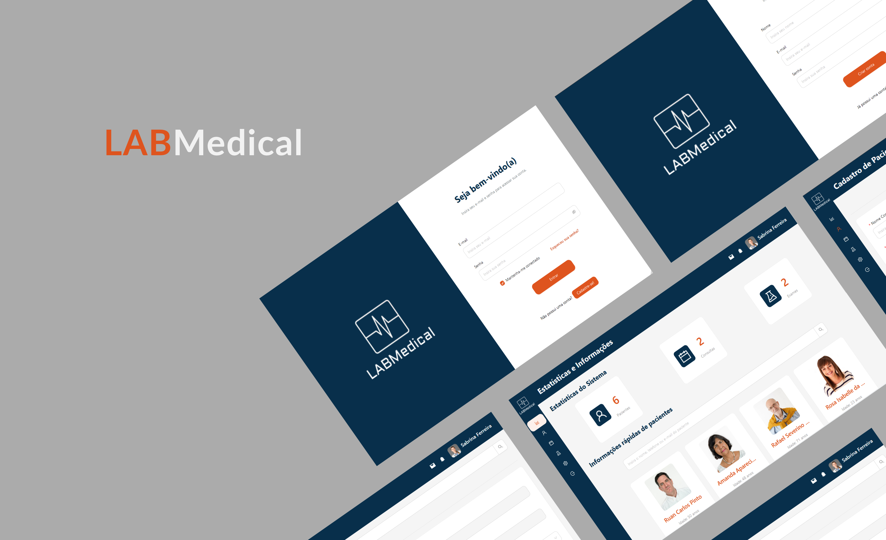

<h1 align="center">LABMedical</h1>

<div align="center">


[](https://react.dev/)
[](https://vitejs.dev/)
[](https://ant.design/)


[](https://opensource.org/licenses/MIT)


[](https://github.com/biachristie/react-labmedical/stargazers)
[](https://github.com/biachristie/react-labmedical/watchers)
[](https://github.com/biachristie/react-labmedical/forks)

</div>
<br>


<p align="justify">
<b>LABMedical</b> é um <i>software</i> para gestão de inventário médico da empresa fictícia LABMedicine LTDA, líder no segmento tecnológico para gestão hospitalar. Essa aplicação foi criada como projeto de conclusão do módulo de <i>front-end</i> do Curso de Capacitação FullStack oferecido pelo Lab365 / Senai - SC.
</p>
<br>

## 🛠️ Tecnologias Utilizadas

Este projeto foi desenvolvido utilizando [React v18.x](https://react.dev/) e as seguintes ferramentas foram usadas durante a sua construção:

- [Ant Design](https://ant.design/) - biblioteca UI para React que fornece um conjunto de componentes para construção de interfaces interativas ;
- [Day.js](https://day.js.org/) - biblioteca JavaScript que interpreta, valida, manipula e mostra datas e horas com API compatível com Moment.js ;
- [json-server](https://www.npmjs.com/package/json-server) - pacote que permite prototipar e simular a criação de uma API REST completa ;
- [prop-types](https://www.npmjs.com/package/prop-types) - pacote que permite documentar os tipos de propriedades repassadas para os componentes ;
- [react-dom](https://www.npmjs.com/package/react-dom) - pacote que serve como ponto de entrada para a DOM e re-renderizadores de servidor para React ;
- [react-router-dom](https://reactrouter.com/en/main) - pacote que contém pontos de ligação para utilização de React Router em aplicações *web* ;
- [ViaCEP API](https://viacep.com.br/) - REST API que permite obter um determinado endereço a partir do Código de Endereçamento Postal (CEP) ;
- [Vite](https://vitejs.dev/) - servidor de desenvolvimento local para modelos de projeto React e Vue ;
- [VSCode](https://code.visualstudio.com/) - editor de código-fonte para construção e *debugging* de aplicações *web* e *cloud*.

<br>

## 💻 Instalação

<p align="justify">
É interessante que tenha <a href="https://git-scm.com/">Git</a> ou outro <i>software</i> de controle de versionamento instalado em seu equipamento, assim como um editor de código como o <a href="https://code.visualstudio.com/">VSCode</a>.
<br><br>
Antes de iniciar a aplicação, execute o servidor que simula o <i>back-end</i>. Esse é um passo importante para o bom funcionamento da aplicação.
</p>
<br>

Siga os passos abaixo para iniciar o projeto em modo de desenvolvimento:

1. Instale Node.JS v18.x+ em https://nodejs.org/en/download ;
2. Clone o repositório no terminal / cmd ;
```
    $ git clone https://github.com/biachristie/react-labmedical.git
```
3. Navegue até o diretório do projeto ;
```
    $ cd react-labmedical
```
4. Instale o gerenciador de pacotes para o Node.JS ;
```
    $ npm install
```
5. Instale as dependências do projeto ;
```
    $ npm install antd --save
    $ npm install dayjs
    $ npm install json-server
    $ npm install prop-types 
    $ npm install react react-dom
    $ npm install react-router-dom
```
6. Execute o servidor ;
```
    $ npm run server
```
7. As mensagens seguintes devem aparecer após ``npm run server`` :
```
    \{^_^}/ hi!

    Loading src/backend/database.json
    Done

    Resources
    http://localhost:3000/users
    http://localhost:3000/patients
    http://localhost:3000/appointments
    http://localhost:3000/exams

    Home
    http://localhost:3000
```
8. Execute a aplicação em modo de desenvolvimento ;
```
    $ npm run dev
```
9. As mensagens seguintes devem aparecer após ``npm run dev`` :
```
    VITE v4.4.3

    Local:   http://localhost:5173/
```
Pronto! Faça bom proveito!

<br>

## 🗂️ Estrutura

```
├───public
└───src
    ├───backend
    ├───components
    │   ├───InputComponent
    │   ├───LoginFormComponent
    │   ├───MenubarComponent
    │   ├───RegisterAppointmentForm
    │   ├───RegisterExamFormComponent
    │   ├───RegisterFormComponent
    │   ├───RegisterPatientFormComponent
    │   └───ToolbarComponent
    ├───context
    │   ├───titles
    │   └───users
    ├───layout
    ├───pages
    │   ├───Home
    │   ├───Login
    │   ├───PatientRecord
    │   ├───Patients
    │   ├───Register
    │   ├───RegisterAppointment
    │   ├───RegisterExam
    │   └───RegisterPatient
    └───services
        ├───Appointment
        ├───Exam
        └───Patient
```
<br>

## ⚙️ Funcionalidades

- Usuários do sistema podem se cadastrar na plataforma *web*
- Usuários cadastrados podem acessar o sistema, que permite:

    - acesso a estatísticas e cartões informativos sobre os pacientes cadastrados;
    - acesso a tabela com as principais informações sobre os pacientes e o total de consultas e exames realizados por cada um;
    - acesso ao formulário para cadastro de pacientes;
    - acesso ao formulário para cadastro de consultas, e;
    - acesso ao formulário para cadastro de exames;

<br>

## ✏️ ToDo

- [x] Página para cadastro do usuário
- [x] Página para entrada do usuário no sistema
- [x] Barra de ferramentas com título da página e informações do usuário
- [x] Menu lateral para navegação entre páginas
- [x] Rodapé da página
- [x] Página de início com dados estatísticos e cartões dos usuários
- [x] Página de cadastro do paciente
- [x] Página de cadastro da consulta
- [x] Página de cadastro do exame
- [x] Página de listagem dos prontuários dos pacientes
- [x] Página de prontuário do paciente
- [ ] Página para recuperação de senha esquecida
- [ ] Página de configurações
- [ ] Calendário com as consultas e exames agendados na página de início
- [ ] Página de listagem das consultas
- [ ] Página de listagem dos exames
- [ ] Página não encontrada personalizada

<br>

## ✍🏻 Autor

Feito por Beatriz Christie 🖐🏻

<br>

## 📌 Licença

Este código está sob a Licença MIT, cujo texto pode ser lido em [MIT License](https://github.com/biachristie/react-labmedical/blob/main/LICENSE.md).
